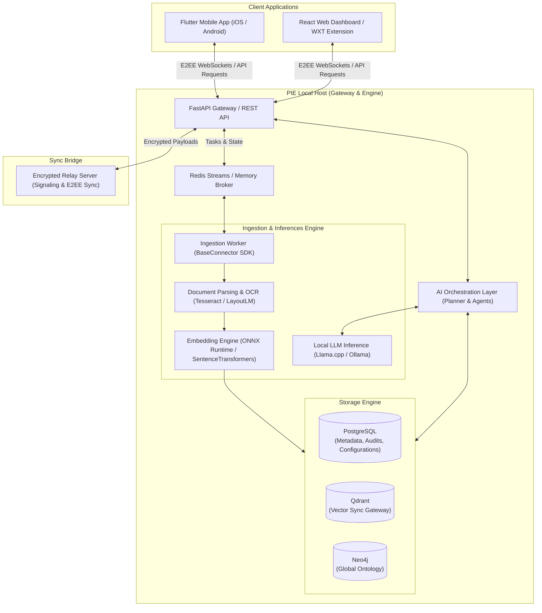

# Personal Intelligence Engine (PIE) System Architecture

This document presents the detailed architectural design of the **Personal Intelligence Engine (PIE)**, a production-grade, local-first, privacy-first AI platform.

---

## 1. Architectural Principles

PIE is built on five core architectural pillars:
*   **Local-First Operations**: Core indexing, storage, search, and logic execution run on the user's local device/home server. WAN connections are not required for core utility.
*   **Zero-Knowledge End-to-End Encryption (E2EE)**: Data stored locally or synced to a relay server is encrypted using user-controlled cryptographic keys (AES-256-GCM + PBKDF2 key derivation).
*   **Retrieval-First, Hallucination-Free Reasoning**: The conversational system is constrained by context injected via hybrid retrieval. If local knowledge is insufficient, the system explicitly declares it.
*   **Asynchronous, Event-Driven Ingestion**: Background connectors ingest data out-of-band and submit it to a priority ingestion queue to prevent UI performance issues.
*   **Extensibility via Connectors & Plugins**: A standardized SDK enables the integration of new data sources (e.g., third-party chat apps, custom APIs) without modifying core engine pipelines.

---

## 2. System Architecture & Topology

The PIE topology supports multi-device deployment. A typical deployment consists of a **Local Host/Home Server** (containing the core engine, indexes, and models) and **Client Apps** (Mobile, Web, Desktop) acting as secure interfaces.

### 2.1 Interface & Edge Layer
*   **FastAPI Gateway**: Serves as the central API orchestrator. It manages user sessions, administers role-based access control (RBAC), routes incoming API requests, and writes ingestion tasks to the event bus.
*   **Flutter Mobile Client**: Local SQLite database encrypted using `sqlite3_multiple_ciphers` (AES-256-GCM) storing relational and graph tables locally. Runs on-device search queries via the `sqlite-vec` extension.
*   **React Web dashboard / Web Extension**: A browser-integrated interface enabling manual document uploads and browser history tracking.

---

## 3. Security & Privacy Design (E2EE)

PIE utilizes a Zero-Knowledge End-to-End Encrypted protocol to synchronize data across devices. The cloud backend acts as an untrusted relay server, storing and routing events without the cryptographic ability to read them.

### 3.1 Key Agreement & Wrapped Keys Mechanism
1.  **Device Key Generation**: During registration, each device generates an Elliptic Curve key pair on the **secp256r1** curve. The private key remains within the device's hardware-backed secure storage.
2.  **Symmetric Encryption**: When a mutation occurs (insert, update, delete), the local device packs the change into a sync event, generates an ephemeral **256-bit symmetric session key**, and encrypts the payload using **AES-256-GCM**.
3.  **Key Wrapping via ECDH**:
    - The sending device fetches the public keys of the user's other authorized devices.
    - It derives a shared secret for each recipient device via Elliptic-Curve Diffie-Hellman (ECDH).
    - It encrypts the session key using this shared secret (Key Wrapping).
4.  **Payload Composition**: The device transmits a batch of sync events consisting of:
    - `device_id`: Originating device UUID.
    - `ciphertext`: Base64 encoded AES-encrypted event.
    - `iv`: Initialization vector.
    - `wrapped_keys`: A map of `{peer_device_id: wrapped_session_key}`.

---

## 4. Local Storage Architecture

The client database combines standard relational modeling, document index files, vector search capabilities, and knowledge graph mappings inside a unified, encrypted SQLite instance.

*   **FTS5 Indexing**: Virtual tables are registered over document chunks and memory nodes to execute high-precision keyword recall.
*   **Vector search**: Dense embedding vectors generated locally using MiniLM-L6-v2 are stored as BLOBs within virtual tables and queried using the C-based `sqlite-vec` extension (`vec_distance_cosine`).
*   **Knowledge Graph (CTE Traversals)**: Nodes and connections are mapped into unified relational schemas (`entities` and `edges`). Multihop relationship queries (e.g., retrieving entities within 2 steps of a person node) are executed client-side using recursive Common Table Expressions (CTEs).
